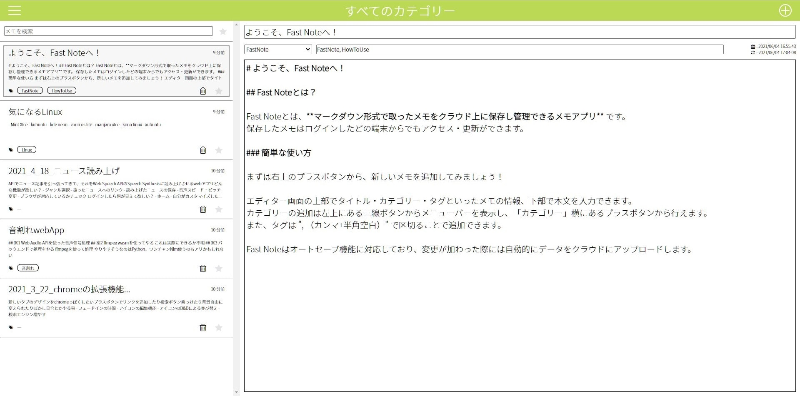

# Fast Note

デモ映像: [https://www.youtube.com/watch?v=W5mR8elF0K8](https://www.youtube.com/watch?v=W5mR8elF0K8)

## Fast Note とは？

Fast Note とは、**マークダウン形式で取ったメモをクラウド上に保存し管理できるメモアプリ** です。  
保存したメモはログインしたどの端末からでもアクセス・更新ができます。

## 主な機能

- アカウント管理
  - 新規作成
  - ログイン
  - ログアウト
  - 削除
- メモ
  - マークダウン形式
  - オプション
    - タイトル、カテゴリ、タグ、作成・更新日時、お気に入り
  - メモの削除
- 自動保存機能
- カテゴリー別閲覧機能
- メモ検索機能
- レスポンシブ対応
- PWA (オンライン時のみ)
- デスクトップ版 (Windows, macOS, Linux)

### 開発中

- メモ閲覧時にメモをスタイリングする

### 実装予定

- 画像投稿機能
- PWA のオフライン対応

## 使用技術

- フロントエンド
  - TypeScript
    - Next.js (React)
    - Recoil
  - Styling
    - styled-jsx
  - Others
    - CodeMirror
    - Jest
    - Prettier
- バックエンド
  - Firebase
    - Authentication
    - Realtime Database
    - Hosting
- デスクトップ版
  - Rust
    - tauri

## こだわり

### 1. データベースの更新

データベースに不要なリクエストを避けるために、ローカルでメモの編集を感知した際、その2秒後のデータと比較して変更がなかった場合にのみ、データベース更新のリクエストを送信する。逆に、比較して変更があった場合は、メモは編集途中であると見なし、リクエストは送信されない。  
そのため、メモの編集直後にはデータベースが更新されず、ワンテンポ遅れた段階で更新される。

### 2. ネイティブアプリ並みの操作性

Webアプリケーションでありつつも、ネイティブアプリのような操作性を実現するために、モバイル及びタブレット端末からアクセスした際は画面下側にハンドルが表示され、それを上下にスクロールすることでメモ一覧のメニューが表示される。

## 反省

### 設計されていないコード

このアプリケーションを制作した当時（2021年6月ごろ）は、「とりあえず動けばいいだろ」の精神で開発を進めていたため、アプリケーション全体の設計が甘い。

例えば、アプリの状態管理では Recoil を使用して各ステートを ./src/lib/atoms ファイルにまとめて管理し、必要に応じて各コンポーネント側から呼び出すという形を取っている。  
しかしアプリの機能を増やす度、その場その場でステートを無秩序に増殖させた結果、事実上グローバル変数と全く変わらないものが大量に生まれてしまった。  
中には、状態更新時にデータベースと通信などを行う巨大イベントハンドラが埋め込まれたステートも存在する。

また、コンポーネントの設計にも問題があり、単純な UI として機能するような最小単位のコンポーネントがほぼ存在せず、常に何らかのロジックと結びついているため、再利用性に乏しく、コードも煩雑としている。

さらにはスタイリングに CSS in JS 系のライブラリを使用しているのを良いことに、不必要に CSS 内に JS を埋め込むようなコードがいつくか見られる。

このように、全体を通してアプリケーションとしての設計がないために、行き当たりばったりでコードを書いていった結果、保守性の悪い煩雑なコードが大量に生まれてしまった。

現在では、アプリケーションを作る場合は初めに必ず設計を行い、アプリケーションの概要から具体的な用途・機能、必要となるモデルの型や状態管理の方式、ワイヤーフレーム、デザインコンセプト、技術選定などを決めた上でトップダウン的にコードを書くようにしている。

### テストがほぼ存在しない

このアプリを制作していた当時は、そもそもプログラミングにおける「テスト」が何を意味するのかを理解していなかったため、ほぼテストコードが存在しない。

その後、テストとは何かを理解するために、[t_wada さんのテスト駆動開発のライブコーディングのアーカイブ](https://www.youtube.com/watch?v=Q-FJ3XmFlT8) を視聴し、その実践として [huskey](https://github.com/denx-official/huskey) という Java 製のパスワードマネージャーの開発を行った（大学のサークル内での集団開発を想定していたが、メンバーが集まらなかったためほぼ一人で開発を進めている）。
